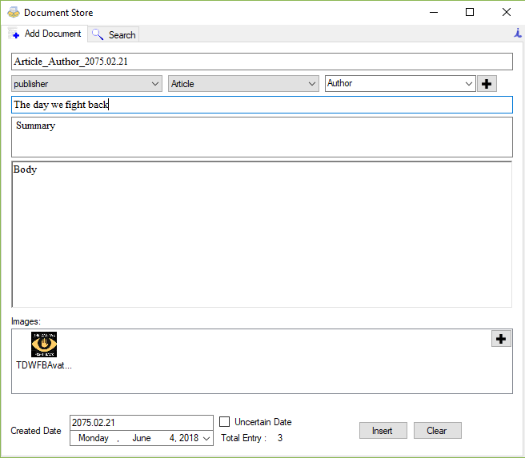
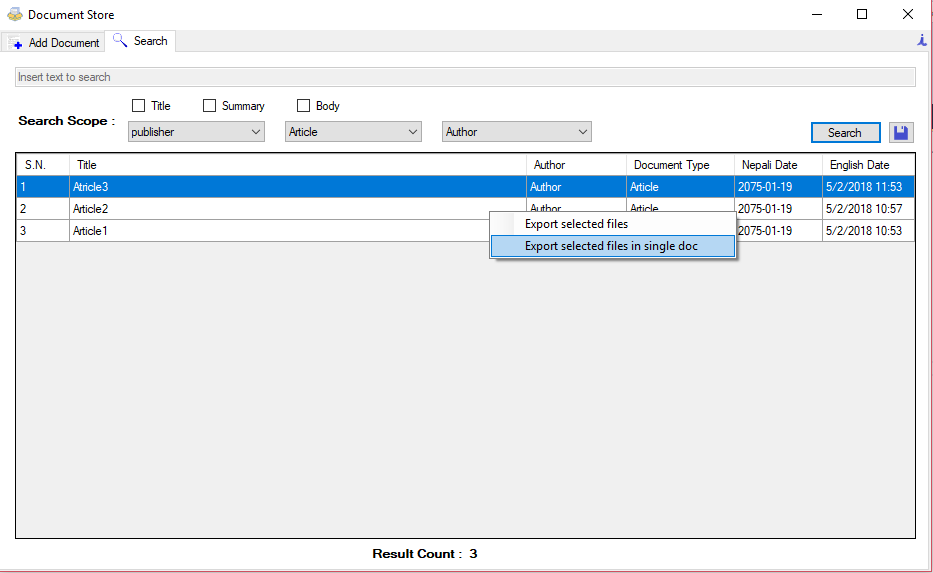

This application is developed on user request to use in Nepal. The purpose of this application is to store the text and metadata of a document in a database so that it can be searched later.

Add Document

Search

